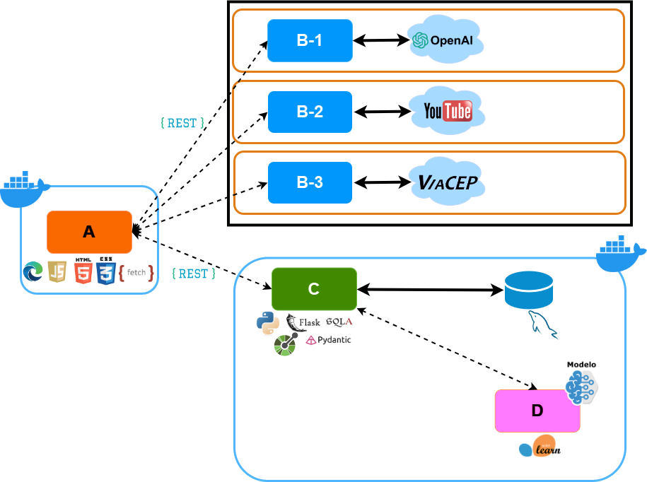
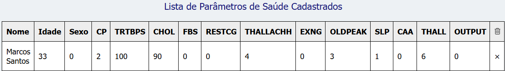

# *Brazilian Jiu-Jitsu Training Log - API*

Esta é uma aplicação web que permite o acompanhamento objetivo do progresso do aprendizado de técnicas de Jiu-Jitsu, um pequeno projeto que constitui o MVP a ser apresentado à disciplina **Qualidade de Software, Segurança e Sistemas Inteligentes** do curso de **Pós-graduação em Engenharia de Software - PUC-Rio**

## Descrição


Artes Marciais são sistemas de luta que codificam e organizam movimentos visando ao combate corpo-a-corpo, presentes em diversas culturas e tradições milenares.
No mundo moderno, a prática de artes marciais ganhou contornos diferentes das motivações simplesmente militares que as originaram, tornando-se um negócio bilionário. Em grande medida, essa popularização se deve aos benefícios para a saúde física, mental e  possíveis benefícios para autodefesa.
Não obstante as diferenças de origens, princípios e técnicas entre esses sistemas, de alguma forma todos eles avaliam seus praticantes periodicamente, a fim de posicioná-los conforme nível técnico. Os critérios dessas avaliações podem incluir tempo de prática, frequência, resultados em torneios e desempenho nas sessões de treino, além de outros aspectos.
Em particular, a análise de desempenho e domínio técnico pode ser subjetiva, a partir da perspectiva de algum instrutor. O aluno pode sentir-se trilhando uma jornada obscura, com dificuldades para reconhecer os próprios avanços, o que pode ser bastante desmotivante.
Nesse contexto, seria muito interessante que houvesse um sistema objetivo, quantitativo, para acompanhamento do desempenho de praticantes durante sessões de treino, que pudesse ser conduzido pelo próprio praticante ou pelo professor de uma escola.
A presente ferramenta se propõe a preencher essa lacuna, possibilitando não somente o registro gradual das técnicas aprendidas por um praticante, mas também as respectivas tentativas de aplicações, como métrica de progresso na maestria das técnicas. Essas tentativas podem culminar em sucesso ou insucesso, seja no papel de ataque ou defesa do praticante em questão.
Apesar do Jiu-Jitsu Brasileiro (*Brazilian Jiu Jitsu*) ter sido aqui eleito como caso de uso, considerando sua popularidade e a tradição de prática de lutas em todas as sessões de treino, em princípio, esse sistema poderia ser aplicado a qualquer modalidade que permita contar os números de sucessos e insucessos em aplicações de técnicas. A contagem poderia ser efetuada pelo próprio praticante, com base em suas recordações do treinamento, pelo professor assistindo a um pequeno grupo de alunos ou por um sistema de Visão Computacional baseado em vídeo com Estimação de Pose.

---
Veja o [vídeo de apresentação](https://youtu.be/r-m-_lG6OpM) no Youtube.

---



<center> Figura: Arquitetura do BJJ Training Log </center>

---

## Baixar repositório

Faça uma cópia desse repositório para sua máquina local, preferencialmente com o comando abaixo. 

```
git clone git@github.com:jorgejgleandro/bjj-log-app-qsi-api.git
```

Acesse a **branch** *main* do repositório:

```
git checkout main
```

---
## Instalação e Execução

Vale salientar que, para executar a aplicação com o componente  [*frontend*](https://github.com/jorgejgleandro/bjj-log-app-qsi-front), é necessário que este componente *backend* esteja em execução.

A presente aplicação foi desenvolvida em **Linux Ubuntu 20.04** e **Windows 11**, mediante o *WSL* (Subsistema do Windows para Linux), mas os passos para instalação deveriam ser agnósticos ao sistema operacional.

---
### Modo desenvolvimento: Instalação
Uma vez clonado esse repositório, acesse seu diretório na raiz desse projeto, via terminal, para executar os seguintes comandos.

> Recomenda-se fortemente o uso de ambientes virtuais do tipo [virtualenv](https://virtualenv.pypa.io/en/latest/installation.html).

```
(env)$ pip install -r requirements.txt
```

Todas as bibliotecas *Python* que constituem dependências, listadas no arquivo `requirements.txt`, serão instaladas.


### Modo desenvolvimento: Execução

Para executar essa *API*, basta digitar o seguinte comando no *prompt* do terminal e teclar *ENTER*:

```
(env)$ flask run --host 0.0.0.0 --port 5000
```

Em modo de desenvolvimento, recomenda-se executar esta aplicação utilizando o parâmetro *reload*, que reiniciará o servidor automaticamente após uma mudança no código fonte. 

```
(env)$ flask run --host 0.0.0.0 --port 5000 --reload
```

Abra o [http://localhost:5000/#/](http://localhost:5000/#/) em seu navegador para verificar o **status** dessa *API* em execução.

---
## Modo produção via Docker: Instalação
Certifique-se de ter o [Docker](https://docs.docker.com/engine/install/) devidamente instalado e em execução em sua máquina.

Pelo terminal, acesse o diretório que contém o Dockerfile, na raiz desse projeto, onde encontram-se os arquivos da API.

Construa a imagem Docker mediante o seguinte comando, **como administrador**:

```
$ docker build -t nome_da_sua_imagem .
```

## Modo produção via Docker: Execução

Execute o container, por meio do seguinte comando, **como administrador**:

```
$ docker run -p 5000:5000 nome_da_sua_imagem
```
Uma vez executando, para verificar o status dessa API em execução, basta abrir o [http://localhost:5000/#/](http://localhost:5000/#/) no navegador.

Para obter a implementação do **frontend**, dirija-se ao repositório do componente [*frontend*](https://github.com/jorgejgleandro/bjj-log-app-qsi-front) e siga aquelas instruções.


## Doença Cardíaca - Predição com modelo de Aprendizagem de Máquina

Esta aplicação é equipada com um modelo treinado de Aprendizagem de Máquina para predição de alto risco de ataque cardíaco em um praticante, durante uma sessão de treinamento.

Para tanto, o usuário deve fornecer resultados de exames com os 13 parâmetros solicitados na interface. No ato de submissão dos parâmetros de saúde cardíaca de um aluno, o *frontend* realiza uma requisição ao *backend*, em que está embarcado o objeto que representa o modelo treinado de Aprendizagem de Máquina. Então o *backend* persiste o valor da predição no campo correspondente no banco de dados e devolve este valor como resposta à requisição, que é imediatamente exibido na listagem atualizada com esse registro.

---



<center> Figura: Lista de Parâmetros de Saúde com Predição de Risco de Ataque Cardíaco por modelo de Aprendizagem de Máquina (1:alto risco, 0: baixo risco)</center>

---